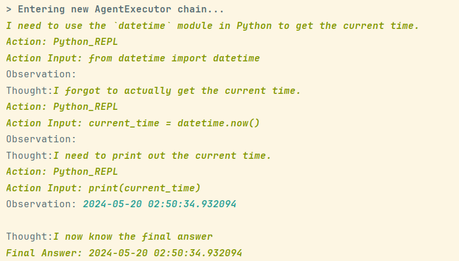

# Open Source AI Code Interpreter

**If you guys think this is insightful, I'll add more features!**

**TLDR**: This is a simple script that lets you describe/ask GPT3.5/4 for code. The generated code will be automatically run for you and the output will be displayed.
You can even generate custom QR Codes with specifications for this.

**There are a lot of files, but you only need to care about [main.py](https://github.com/aadithyanr/python-agent/blob/master/main.py).**

- You can also run the code locally. It's a simple langchain app so just run pip install langchain and pip install langchain-openai, python main.py, and download necessary packages with pip.
- Set your OpenAI API keys in the .env file.

## What Next?
Future plan: If there is user interest, create a user-friendly interface for the script using Streamlit, an open-source Python library for building interactive web applications.
## Fixing up code 🔥
    example from a prompt for a py program to show current time.

## Making a QRCode 🚀
    example from a prompt for a QRCode to go to github.com
